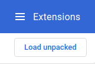

<h1 align="center">
    
</h1>

<h4 align="center">
	🚀 Miopia Chrome Extension 🚀
</h4>

  

  

  

  

  

  <a href="#-project">Project</a>
  &nbsp;&nbsp;&nbsp;|&nbsp;&nbsp;&nbsp;
  <a href="#rocket-Technologies">Technologies</a>
  &nbsp;&nbsp;&nbsp;|&nbsp;&nbsp;&nbsp;
  <a href="#-Chrome">Chrome Webstore</a>
  &nbsp;&nbsp;&nbsp;|&nbsp;&nbsp;&nbsp;
  <a href="#-how-to-contribute">How to contribute</a>
  &nbsp;&nbsp;&nbsp;|&nbsp;&nbsp;&nbsp;
  <a href="#memo-license">License</a>

## 💻 Project

> Turns the page blur when you click the icon

<h1 align="center">
    
</h1>

## Load into Chrome

To load the built files into Chrome, open [chrome://extensions/](chrome://extensions/).

Enable "Developer mode" if it's not enabled yet:

Click on "Load unpacked":

Find the `folder/` directory on your system and open it.

The extension should be now at the top of the page:

## :rocket: Technologies

This project was developed with the following technologies:

- [JavaScript](https://developer.mozilla.org/pt-BR/docs/Web/JavaScript)
- [Chrome Extension](https://developer.chrome.com/extensions/devguide)

## :tada: Chrome Webstore

you can download the extension for chrome straight from the [webstore](https://chrome.google.com/webstore/detail/lookup-mac-address/cjmkeakikfcijjbcdlgominglghpbojf).

## 🤝 Contributing

Contributions, issues and feature requests are welcome! Feel free to check [issues page](https://github.com/godrix/miopia-chrome-extension/issues).
- Make a fork;
- Create a branck with your feature: `git checkout -b my-feature`;
- Commit changes: `git commit -m 'feat: My new feature'`;
- Make a push to your branch: `git push origin my-feature`.

After merging your receipt request to done, you can delete a branch from yours.

## Show your support

Give a ⭐️ if this project helped you!

## :memo: License

This project is under the MIT license. See the [LICENSE](LICENSE.md) for details.

---

Made with ♥ by Godrix :wave: [Get in touch!](https://www.linkedin.com/in/carlosgodri/)
